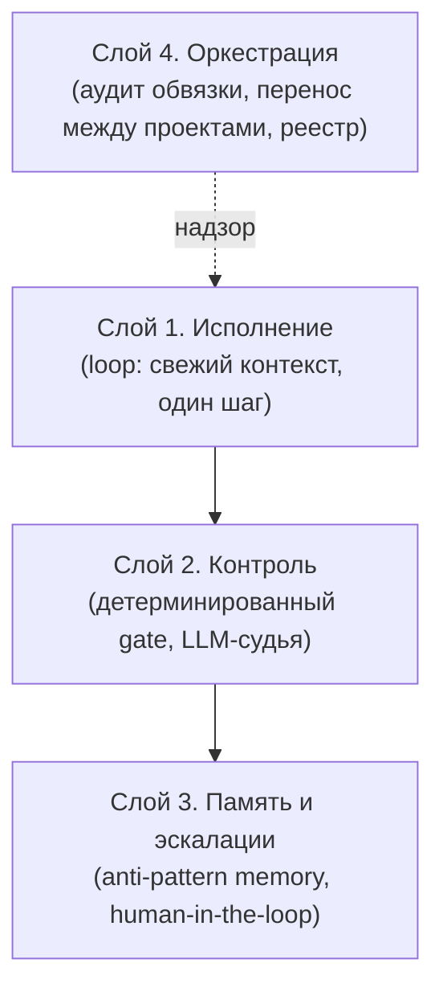
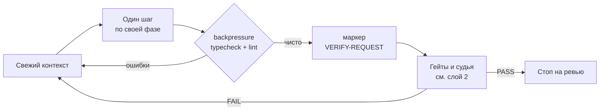
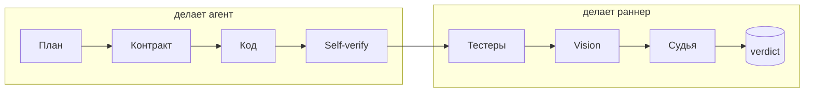
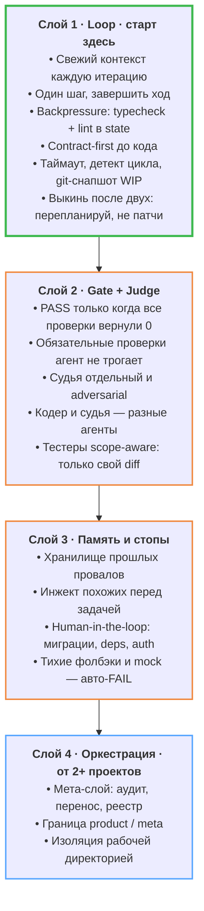

# Dark Factory: автономный кодовый пайплайн вместо одного агента в чате

*Подготовлено для сообщества [DeSlop](https://t.me/ai_deslop)*

В 2025 Китай запустил «тёмные фабрики». Это производства без людей и без света. Роботы собирают роботов, линия идёт 24/7, человек подключается только когда что-то сломалось.

В кодинге это уже происходит. Просто большинство всё ещё сидят в одном чате с одной моделью и правят её руками на каждой второй итерации.

Я полгода собирал не «умного ассистента», а автономный пайплайн. Он сам пишет код, сам его проверяет и сам останавливается, когда лезет в опасное. Ниже архитектура по слоям, схемы и чеклист, как собрать такой же. Харнес я выложил в открытый код, ссылка в конце.

***

## Не модель, а обвязка

Почти все апгрейдят модель. Берут Opus или GPT-5.5, открывают чат, кидают большую задачу и начинают нянчить. Агент поплыл, поправили. Снова поплыл, снова поправили.

Проблема в том, что одна модель в чате болеет ровно тем, что мы уже разбирали: дрейф цели, гниение контекста, туннельное мышление. На коротких задачах это незаметно. На длинных любая модель деградирует к десятому шагу.

Качество на длинной дистанции даёт не модель. Его даёт обвязка вокруг неё: цикл со свежим контекстом, детерминированные гейты, отдельный судья, память об ошибках и слой оркестрации.

Модель это движок. Без коробки, подвески и тормозов на нём далеко не уедешь.

Вот как слои складываются вместе.

***

## Слой 1. Loop

Сердце пайплайна это цикл, который гоняет агента по одному простому правилу: один шаг и завершить ход. Дальше раннер запускает агента заново, с чистого контекста.

Зачем свежий контекст каждую итерацию. Длинный чат гниёт, это та самая болезнь context rot. Чем дольше агент крутится в одном окне, тем больше там мусора: старые гипотезы, отменённые решения, противоречивые правки. Свежий контекст лечит это структурно, на уровне архитектуры, а не «переинжектируй правило каждые пять шагов». Память при этом не теряется, она лежит на диске, а не в окне модели.

Что происходит за одну итерацию:

Несколько вещей, которые делают это рабочим.

**Backpressure.** После шага раннер сам прогоняет typecheck и линтер. Упало, текст ошибки летит обратно в state, и следующая итерация начинается с починки. Агенту не надо про это помнить. Цикл сам толкает его назад, пока не станет зелено.

**Contract-first.** До того как написать строчку кода, агент фиксирует контракт: проверяемые критерии готовности. Это договорённость с судьёй *до* кода. Нет контракта, и судья сразу возвращает «недостаточно доказательств». Звучит как бюрократия, но именно это отрезает «я что-то написал, вроде работает».

**Разделение фаз.** Агент ходит только по своим фазам: план, контракт, код, self-verify. Проверку (тестеры, vision, судья) запускает раннер, а не агент. Тот, кто пишет код, не должен сам решать, что код готов.

**Защита от зацикливания** живёт в раннере, а не в модели: таймаут итерации с убийством дерева процессов, детект одинаковой ошибки N раз подряд, детект отсутствия прогресса (N итераций без изменения кода), потолок итераций, git-снапшот work-in-progress на каждом шаге.

**Правило «выкинь после двух».** Если один и тот же критерий заваливается дважды подряд, агент не патчит его в третий раз. Он обязан сказать «решение архитектурно неверное, нужен новый план», и цикл перезапускается с фазы планирования. Это прямое лекарство от туннельного мышления, когда агент долбится в одно сломанное решение и придумывает всё новые оправдания, почему оно правильное.

***

## Слой 2. Gate + Judge

Главное, что я понял про проверку: вердикт должен быть детерминированным, а не «модель решила, что готово».

PASS выставляется только когда все проверки зелёные: typecheck прошёл, линтер чист, контракт выполнен, обязательные команды из конфига вернули 0. Это не мнение, это арифметика. Список обязательных проверок лежит в конфиге, и агент не может его удалить. Любая попытка срезать угол упирается в гейт.

А судья? Судья это LLM-as-judge в adversarial-режиме, и он совещательный. Его установка: «PASS только если я не нашёл ни одной причины завалить». Он ищет дыры: тест зелёный, но проверяет не то; покрыт только happy path; код противоречит сам себе; AI-slop с тихими фолбэками. Но его мнение не выставляет вердикт. Оно идёт в список работ на следующую итерацию.

Почему судья отдельный и совещательный, а не главный:

- Если код писала модель и она же его оценивает, это confirmation bias в чистом виде. Поэтому судья работает в изолированном свежем контексте, по жёсткой рубрике.
- Подхалимаж судьи карается. «Отлично, всё хорошо», когда баги открыты, это провал самого судьи, а не пропуск задачи.
- Гейт детерминирован и воспроизводим, а судья нет. Поэтому блокирует гейт, а судья только подсказывает.

Тестеры тоже изолированы и scope-aware: каждый видит только diff и свою зону. Трогал API, пришёл API-тестер. Не трогал UI, vision-тестер не дёргается. Экономит и время, и токены.

***

## Слой 3. Память и эскалации

Две вещи, без которых автономность превращается в автономное вредительство.

**Память об ошибках.** Два независимых хранилища: лёгкая история разработки (решения, провалы, ретро) и векторная база анти-паттернов. Перед нетривиальной задачей хук достаёт похожие прошлые провалы и инжектит их в контекст блоком «известные грабли, не наступай снова». Пайплайн буквально не повторяет вчерашних ошибок, потому что они лежат на диске и подсовываются заранее, а не «помнятся» моделью.

| | История разработки | Анти-паттерны |
|---|---|---|
| Бэкенд | SQLite + векторный поиск | Postgres + pgvector |
| Что хранит | решения, провалы, ретроспективы | повторяющиеся ошибки агента, bug-ledger |
| Кто пишет | вердикты, ручные записи | ретроспектор после итерации |
| Кто читает | запросы по эмбеддингам | хук инжекта перед задачей |

**Human-in-the-loop на опасных операциях.** Автономность не значит «делай что хочешь». Список опасных зон лежит в конфиге: миграции БД, изменения зависимостей, CI, контейнеры, auth, удаление большого числа строк в одном файле. Агент лезет туда, цикл останавливается и зовёт меня. Правомерную правку я одобряю руками. Но молча накатить миграцию или уронить прод-конфиг автономный агент не должен.

И отдельный запрет на «hobbling along»: тихие фолбэки, catch-and-ignore, mock-данные без пометки, дефолтный конфиг без предупреждения. Каждая такая конструкция это авто-FAIL у судьи. Это тот самый slop, который выглядит как рабочий код и при этом полностью неверен.

***

## Слой 4. Оркестрация

Когда проектов с такой обвязкой становится больше одного, нужен слой, который следит за самой обвязкой. У меня это отдельный мета-слой, управляющий над всеми проектами на машине.

Он не пишет продуктовый код. Вообще. Он делает другое: аудит проектов (на месте ли `CLAUDE.md`, хуки, судьи, нет ли мусора и протёкших настроек), разработку и перенос обвязки между проектами, реестр проектов и вики типичных ошибок.

Самое дорогое, что я отсюда вынес, это жёсткая граница product / meta. Однажды кодовый агент одного проекта полез за служебными файлами в папку мета-слоя. После этого правило стало железным: задачи продукта живут в проекте, аудит и findings в мета-слое, и они не пересекаются.

Тонкий момент про изоляцию: она держится рабочей директорией агента, а не deny-правилом с именем внешней папки. Если написать агенту «не лезь в папку X», ты этим сообщаешь ему, что папка X существует. Кодовый агент не должен знать, что над ним есть управляющий слой. Он видит свой проект как весь мир, и этого достаточно.

Для одного проекта слой 4 избыточен. Но как только проектов несколько, без него обвязка расходится, и каждый проект гниёт по-своему.

***

## Где в этой схеме я

Не пишу код в чате руками. Я работаю на уровне выше: разбираю эскалации, когда сработал стоп, читаю вердикты, правлю контракты и переношу удачные приёмы из ретроспектив в инструкции.

Это и есть переносимая мысль. Не «дай задачу самой умной модели и молись», а «построй пайплайн, в котором даже средняя модель не может молча выкатить slop, потому что её ловят гейты, тестеры и судья».

***

## Собери свой пайплайн

Слои включаются по одному, снизу вверх. Минимум, который уже работает, выделен зелёным: Слой 1 плюс детерминированный гейт из Слоя 2. Дальше навешиваешь остальное.

***

## Частые ошибки

| Ошибка | Чем кончается | Что делать |
|--------|---------------|------------|
| Апгрейдить модель вместо обвязки | Дорого и всё равно slop | Собери пайплайн, модель вторична |
| Один длинный чат на всю задачу | Дрейф, context rot | Свежий контекст, один шаг за итерацию |
| Агент сам решает, что готово | Подхалимаж, «done» без done | Детерминированный гейт плюс отдельный судья |
| Вердикт «на усмотрение модели» | Невоспроизводимо | PASS только по зелёным проверкам |
| Полная автономия без стопов | Молча снёс прод-конфиг | Human-in-the-loop на опасных зонах |
| Память только в контекстном окне | Те же грабли каждый день | Anti-pattern memory на диске плюс инжект |

***

Харнес, я снял со своего проекта Samantha (кто смотрел фильм Her, поймет про что проект) всю проектную специфику и выложил в open source, назвал [bro-coding-factory](https://github.com/AVVlasov/bro-coding-factory). Там цикл, гейты, судья, триггеры и память. Бери, подключай свой агент-бэкенд, настраивай под свой стек.

Перестань нянчить агента в чате. Собери пайплайн.

[DeSlop](https://t.me/ai_deslop). Меньше слопа. Больше дела.
