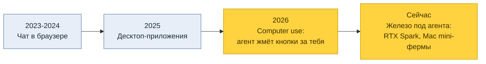
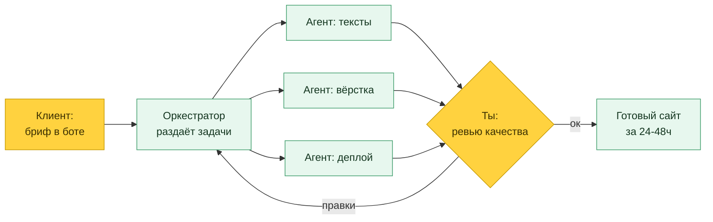
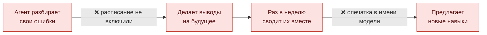
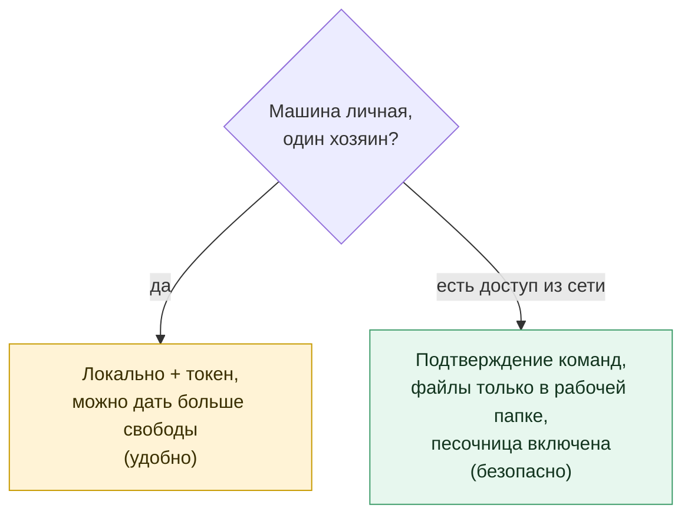

# Заведи себе Саманту: почему ИИ переезжает с облака к тебе на диск

> «I'm sorry, Dave. I'm afraid I can't do that.»
> — HAL 9000, *2001: A Space Odyssey*

материал подготовлен сообществом [DeSlop](https://t.me/ai_deslop) 

Сорок лет нас учили бояться этой фразы. Бортовой компьютер сам решает за человека и отказывается открыть шлюз. А теперь смешное. Сегодня эту фразу тебе говорит не Skynet, а служба поддержки облачного сервиса. «Ваш тариф не поддерживает эту операцию.» «В вашем регионе недоступно.» «Мы обновили API, ваш старый сценарий больше не работает.»

Я строю Саманту, личного ассистента, который живёт не в чужом дата-центре, а у меня на компьютере. И чем дольше я этим занимаюсь, тем яснее одна мысль. Настоящий ассистент работает не как сервис, которому ты платишь ренту. Он работает как зверёк, который живёт у тебя на диске, помнит твои дела и пашет на тебя. Не HAL за стеклом, а скорее JARVIS из дома Тони Старка: «уже сделал, сэр», только на твоём железе.

Этот текст для тех, кто слышал про OpenClaw, но так и не поставил. И для тех, кто поставил, но не уверен, что оно реально работает, а не просто показывает зелёную галочку. Сначала коротко покажу, куда поехал весь мир, это меньшая часть. Потом честно разберу три провала, которые мы уже прошли за тебя. В конце дам чеклист из 8 пунктов: что включить первым делом и как убедиться, что оно живое, а не «включено на бумаге».

Если хочешь сэкономить пять минут чтения: самое ценное тут не новости про Хуанга, а часть 4 (наши провалы) и чеклист в конце. Новостями можешь пролистнуть.

> **TL;DR, что заберёшь из статьи:**
>
> - 🧠 **Железо уже строят под агентов**, не под клики мышкой: RTX Spark, фермы из Mac mini.
> - 🦞 **OpenClaw — это зверёк на твоём диске**, а не облачный сервис с рентой и правом сказать тебе «I can't do that».
> - 🎬 **Сюжет «Her» ложится на реальную архитектуру**: память, профессии, оркестратор, руки. Таблица ниже.
> - 🔴 **Три наших провала** (часть 4): мы наступили на грабли за тебя.
> - ✅ **«Включено» ≠ «работает»**: жизнь системы видно по файлам на диске. Первый шаг — за 5 минут, в конце.

---

## Сюжет «Her», разложенный на архитектуру

Проще всего объяснить, что мы строим, через фильм. В «Her» Саманта — это операционная система, которая помнит героя, ведёт его дела, растёт и работает на него. Мы взяли этот сюжет и разложили его на реальные примитивы OpenClaw.

| В фильме «Her» | В архитектуре на OpenClaw |
|---|---|
| Саманта помнит героя и весь контекст | Постоянная память между сессиями, на диске |
| У неё характер и таланты | Профессии: эксперт-оркестратор плюс узкие помощники |
| Она сама раздаёт себе задачи и справляется | Оркестратор дробит задачу и делегирует суб-агентам |
| Она незаметно растёт по ходу фильма | Самообучение: агент разбирает свои ошибки |
| Ей не хватает тела и рук | Computer use: агент видит экран и жмёт кнопки |
| Она его, не арендованная | Локально, без чужого облака и чужого рубильника |

> 💡 Дальше вся статья — это честная версия этой таблицы: где красивый сюжет бьётся о реальную инженерию.

---

## Часть 1. Мир уже развернулся к локальным агентам

### Хуанг: ПК теперь не для тебя, а для агента на нём

1 июня 2026 на GTC Taipei Дженсен Хуанг показал суперчип RTX Spark и назвал это самой большой переделкой компьютера за 40 лет, сравнимой с переходом от кнопочных телефонов к смартфонам. Формулировка простая до неприличия. Раньше ты запускал приложение, кликал и печатал. Теперь ты просишь, а компьютер делает.

Один петафлоп вычислений, 128 ГБ общей памяти, агенты, которые тянут многошаговые задачи прямо на устройстве без постоянного похода в облако. Компьютер из пассивного инструмента превращается в напарника. Те самые первые машины Хуанг лично развёз Маску и Альтману как драгоценность. Сигнал индустрии понятен: железо теперь проектируют под агента, который на нём живёт, а не под человека, который кликает мышкой.

### Microsoft Scout: цифровой коллега, который не ждёт промпта

На Build 2026 Microsoft показала Scout, и пресса прямо назвала его «вдохновлённым OpenClaw». Это не чат-бот, а фоновый помощник. Он сидит в Teams, Outlook и OneDrive, делает звонки, пишет письма, ставит встречи. На демо ноутбук Surface в простое тратил на него 2–4% процессора и 300 МБ памяти. Главная мысль с презентации: агент, который не ждёт, пока его о чём-то попросят.

### У каждой LLM теперь есть десктоп, который умеет жать кнопки

Anthropic ещё в марте 2026 показала, что Claude умеет управлять твоим компьютером: локальный доступ к файлам, расписания, режим, где ты ставишь задачу с телефона, а агент доделывает её на твоём ПК. У ChatGPT свой десктоп с запуском кода и браузером. Тренд один. Модель спускается с веб-страницы на твою операционку и получает руки.

Вопрос больше не в том, появится ли личный ИИ-агент на твоём ПК. Он уже появился у всех. Вопрос в том, чей он будет: твой, на твоём диске, или арендованный у чужого облака с правом в любой момент сказать тебе «I can't do that, Dave».

> 💡 **Вывод.** Настраивая локального агента сейчас, ты не опережаешь тренд, **ты догоняешь индустрию**. Опаздывать дальше будет дороже.

---

## Часть 2. Китай ставит OpenClaw бабушкам, а США сметают Mac mini

OpenClaw это открытый локальный ИИ-агент австрийца Петера Штайнбергера (да, с эмблемой лобстера). Запускается у тебя на машине, бронирует билеты, разбирает почту, тянет рутину так, что один человек начинает работать за нескольких. Отсюда термин, который прижился: «компания из одного человека».

Дальше произошло вот что.

**Китай.** Baidu и Tencent проводят митапы, где обычных людей учат поставить OpenClaw. На одном мероприятии в Шэньчжэне **больше 1000 человек ставили его прямо в зале**. Власти Шэньчжэня, Уси и Ханчжоу пишут субсидии под экосистему «компаний из одного человека».

Рынок отреагировал деньгами. Tencent подскочил на 6,2% после анонса своего агента на OpenClaw, Zhipu прибавил до 16% на своём клоне, MiniMax около 15% на своём. Выросла целая надомная индустрия: люди продают установку и преднастроенное железо тем, кто хочет, но сам не умеет.

**США.** Всплеск OpenClaw устроил **дефицит Mac mini M4**. Энтузиасты и разработчики разобрали их как идеальное «всегда включённое» железо под автономных агентов: компактный, тихий, общая память, относительно дёшево. Появились гайды «домашний AI-сервер на Mac mini», несколько таких мини собирают в локальный кластер под нагрузку. Apple при этом тянет с новой версией mini из-за нехватки памяти, спрос обогнал предложение.

| Регион | Что движет спросом | Чем меряется |
|---|---|---|
| 🇨🇳 Китай | Господдержка, митапы Baidu и Tencent, надомная установка | 1000+ установок за вечер, рост акций на клонах |
| 🇺🇸 США | Локальные агенты 24/7, приватность, отказ от облачной ренты | Дефицит Mac mini M4, домашние кластеры |

> ⚠️ **Риск.** Локальный агент с полным доступом к машине — это сила и риск в одном флаконе. Пекин одновременно выпускает предупреждения по безопасности, и правильно делает. К уровням доступа вернёмся в чеклисте.

---

## Часть 3. «Компания из одного человека» это не метафора

> «Come with me if you want to live.»
> — T-800, *Terminator 2*

Грубовато, но по делу. Пока рынок труда переваривает агентов, у тебя есть окно. Собрать на локальном ИИ маленький автономный бизнес, который раньше требовал целой команды.

У нас есть рабочий чертёж — **Zero Human Web Studio**, веб-студия без людей в цепочке. Клиент заполняет бриф в боте, агенты собирают лендинг, дальше деплой.

Посчитай экономику: **24–48 часов вместо двух-четырёх недель** у студии, **5–15 тысяч рублей вместо 60–200 тысяч**. Лендинг, который раньше кормил трёх фрилансеров, схлопывается до стоимости токенов и часа твоего ревью.

Это не магия по кнопке, а конвейер, где ИИ работает инфраструктурой, а ты остаёшься главным инженером и контролёром качества. Тот же принцип переносится на контент, аналитику, поддержку, рассылки.

Главная метрика тут не «вау, агент сам написал сайт». Главная метрика это переносимость. Сможешь ли ты завтра поднять такой же конвейер под свой домен. Сможешь.

---

## Часть 4. Где мы налажали (и почему всё равно советую)

Доверие зарабатывается не победами, а честными провалами. Вот три наших, простым языком.

**Провал 1. Агент «худел» только на бумаге.**
Чем больше у агента навыков, тем больше инструкций грузится ему в голову перед каждым запросом. Голова переполняется, агент начинает тупить и путаться. Мы решили оставлять каждому помощнику только три-четыре нужных навыка, а остальное прятать. В заметках записали: «готово, по три навыка на каждого». А когда наконец замерили реальную нагрузку, выяснилось, что агент по-прежнему грузит всё подряд.

> 🔍 **Грабли.** Мы починили проблему на словах, а не на деле. Урок: **проверяй по замеру**, а не по тому, что сам себе написал «сделано».

**Провал 2. Самообучение тихо умерло на 40 дней.**
Мы научили агента разбирать свои ошибки и делать выводы на будущее. Включили, поздравили себя, пошли дальше. А оно молча не работало почти полтора месяца. Причины оказались до обидного мелкими. В настройках стояло несуществующее имя модели (по сути опечатка), а расписание, которое должно было всё это запускать, по факту никто не включил. Снаружи всё выглядело живым, внутри не происходило ничего.

> ⚠️ **Грабли.** «Включено» не равно «работает». Жизнь системы видно по новым файлам на диске, а не по зелёной галочке в настройках.

**Провал 3. Геймификация вместо пользы.**
Раздел с навыками мы сначала превратили в игру: очки, уровни, значки, «прокачка персонажа». Выглядело модно, пользы ноль. Выкинули целиком и заменили на простой экран, где видно, как агент берёт задачу, раздаёт её помощникам, проверяет и собирает результат.

> 💡 **Вывод.** Геймификация — это слоп: красивая обёртка, за которой пусто. **Красиво не значит полезно.**

И есть четвёртая категория, поспокойнее: мелкие технические ловушки при настройке. Канал вроде подключён, а молчит. Один и тот же ключ на двух устройствах гоняет агента по кругу. Команды со спецсимволами приезжают в кашу. Всё это не падает с громкой ошибкой, оно тихо не работает, и узнаёшь ты об этом, только когда специально проверишь.

**Что общего у всех четырёх.** Ни один провал не был про «слабую модель» или «сырую технологию». Все они про монтаж и про привычку верить галочке. Поэтому каждая строка чеклиста ниже отвечает не «что включить», а **«как убедиться, что включённое работает»**.

---

## Часть 5. Новые фичи OpenClaw, на которые стоит смотреть

Платформа повзрослела. Главное по делу, без пресс-релиза:

| Фича | Что делает | Зачем тебе | Включать первым? |
|---|---|---|---|
| Мастерская навыков | Ревью перед активацией любого нового навыка | Агент не перепишет себя втихую | ✅ Да |
| Оркестратор + помощники | Дробит задачу, раздаёт до 8 исполнителям | Параллельная работа, своя модель под задачу | По надобности |
| Windows-хост (2026.6.1) | Нормальная работа на Windows без прослоек | Если ты на Windows | ✅ Да |
| ClawHub | Реестр навыков с тремя проверками на вирусы | Безопасная установка чужих навыков | По надобности |
| Computer use | Видит экран, жмёт кнопки | Те самые руки агента | ✅ Да |

> ⚠️ **Совет.** Бери зрелый формат навыков. Сырые экспериментальные надстройки отложи, пока не устаканятся. Меньше зависимостей от незрелого — меньше тихих поломок.

---

## Часть 6. Что настроить первым делом (чеклист)

> «There is no spoon.»
> — *The Matrix*

Ложки нет, а контекста, моделей и расписаний — есть.

> **Золотое правило.** «Включено» ≠ «работает». Каждую настройку проверяй по результату: ответу модели, новому файлу, записи в логе.

Три вещи убивают настройку тихо, без единой ошибки в логах: **опечатка в имени модели**, **расписание, которое никто не включил**, и **агент, открытый в сеть без токена**. Все три уже стоили нам времени. Все три закрываются колонкой «как проверить».

| # | Шаг | Зачем | Как проверить |
|---|---|---|---|
| 🟢&nbsp;1 | Запустить `openclaw doctor` | Конфиг цел, всё на месте | Команда отрабатывает без ошибок |
| 🟢&nbsp;2 | Закрыть доступ к агенту: только локально + токен | Чтобы зверька нельзя было достать из сети | В сетевых соединениях только localhost |
| 🟢&nbsp;3 | Задать основную модель и запасные | Будет страховка при сбое или лимите | Проверь руками каждое имя модели, опечатка молча валит страховку |
| 🟢&nbsp;4 | Включить сохранение памяти, держать заметки короткими | Агент не теряет важное между сессиями | После долгой сессии появилась новая запись |
| 🟢&nbsp;5 | Пускать в чаты только своих (белый список) | Команды шлёшь только ты, а не случайный человек | Сообщение от чужого игнорируется |
| 🟠&nbsp;6 | Осознанно выбрать уровень доверия | Доступ к командам и файлам это компромисс, а не «чем больше, тем лучше» | Прогнать аудит безопасности |
| ⚪&nbsp;7 | Веб-поиск, распознавание и генерация картинок | Свежие данные и работа с изображениями | Тестовый запрос реально возвращает результат |
| ⚪&nbsp;8 | Самообучение запускать настоящим планировщиком | Чтобы агент накапливал опыт, а не забывал | Назавтра на диске появился новый файл с выводами |

### Об уровне доверия — отдельно

Самая мощная сборка (агент может выполнять любые команды и читать любые файлы без подтверждения) допустима только на личной машине с одним хозяином, закрытой от сети. Как только ты открываешь к ней доступ снаружи, это превращается в чужие руки на твоём компьютере. **Закрывай периметр снаружи внутрь**: сначала запри доступ из сети, и только потом ослабляй внутренние ограничения.

---

## Итог: чей это будет голос

В фильме «Her» Саманта это операционная система, которая знает героя лучше, чем он сам. Весь сюжет держится на одном. Она его. Не общая, не арендованная, не отключаемая по решению чужого продакт-менеджера.

Сегодня это перестало быть фантастикой. Хуанг строит железо под агентов. Microsoft показывает цифрового коллегу. Китай ставит OpenClaw бабушкам, Америка сметает Mac mini. У каждой большой модели уже есть десктоп с руками. Поезд не «уходит», он едет, и в нём едут все, кроме тех, кто ждёт идеального тарифа в облаке.

### Конкретный первый шаг

Если дочитал до сюда, у тебя есть всё, чтобы начать сегодня, а не «когда-нибудь». Первый шаг занимает пять минут: запусти `openclaw doctor`, закрой агента токеном, прогони один тестовый запрос.

- **Отбивает чисто** — ты уже дальше большинства тех, кто читал про локальный ИИ и ничего не поставил.
- **Падает** — у тебя теперь конкретная задача вместо размытого «надо бы разобраться с ИИ».

Дальше заведи одну привычку: **проверять по файлу на диске, а не по зелёной галочке**. На этом держится всё остальное.

Меньше HAL, который говорит «I can't do that». Больше JARVIS, который говорит «уже сделал».

[DeSlop](https://t.me/ai_deslop). Меньше слопа. Больше дела.
