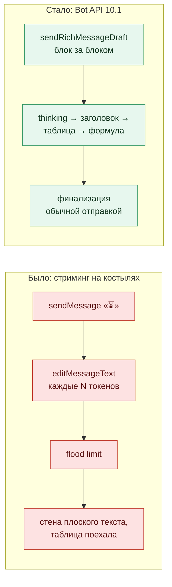
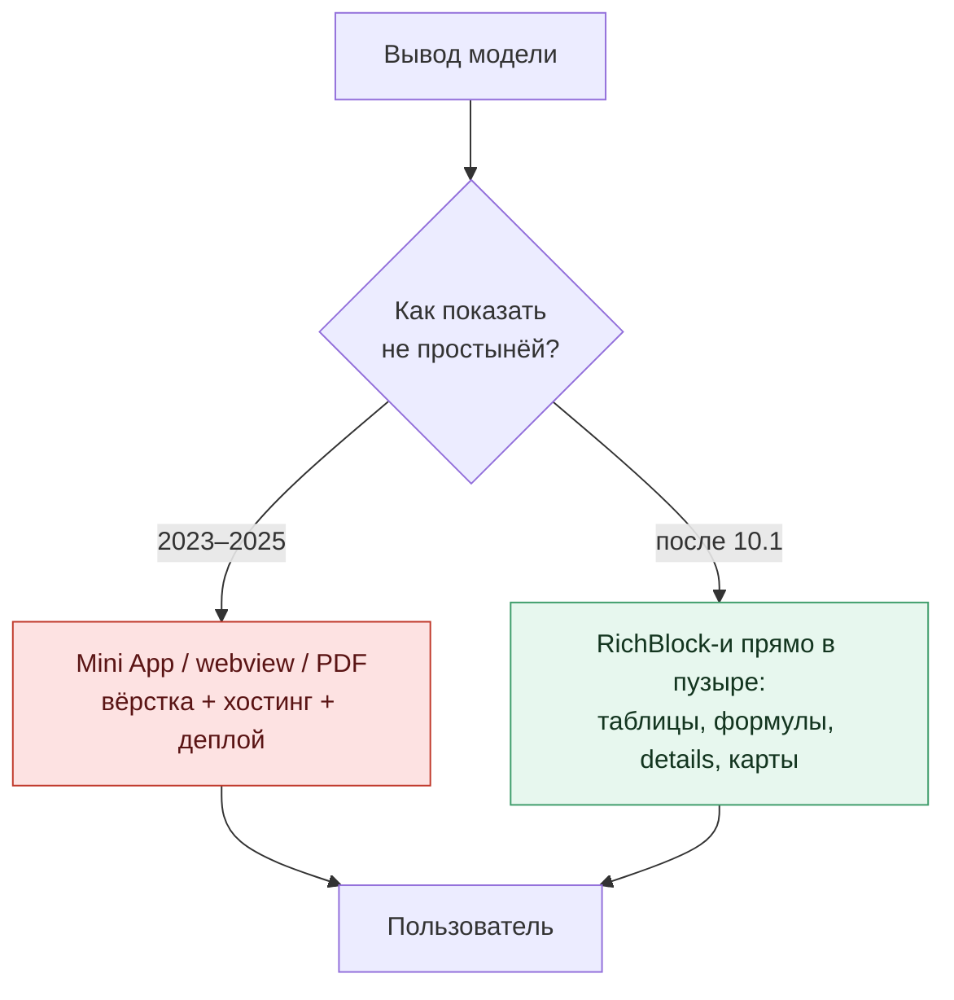

# Мессенджер съел фронтенд

> «...text formatting so rich you'll want to start a riot and demand to tax it.»
> — [блог Telegram](https://telegram.org/blog/watch-apps-and-more), 11 июня 2026

материал подготовлен сообществом [DeSlop](https://t.me/ai_deslop) 

Ты пишешь боту вопрос. Он отвечает «⌛», потом сообщение начинает дёргаться: это `editMessageText` перерисовывает ответ по мере генерации. На пятой перерисовке прилетает flood limit, бот давится и вываливает стену плоского текста. Таблица, которую модель аккуратно собрала, превратилась в кашу из дефисов и палок.

Так выглядел каждый второй ИИ-бот в Telegram весь 2025 год. Я знаю. Я такие писал.

11 июня Telegram выкатил [Bot API 10.1](https://core.telegram.org/bots/api-changelog), и весь этот цирк можно закрывать. Дальше по порядку: что выкатили, почему это ломает привычную архитектуру ИИ-ботов, три бота, которые собираются за вечер, грабли, на которые я уже наступил за тебя, и чеклист первого вечера.

> **TL;DR, что заберёшь из статьи:**
>
> - 💬 **Пузырь чата стал документом**: таблицы, формулы, карты, сворачиваемые секции. Нативно, без webview. 32 768 символов вместо 4096.
> - ⚡ **Стриминг стал методом API**: `sendRichMessageDraft` рисует ответ блок за блоком, как ChatGPT в браузере, без flood limit.
> - 🧠 **`RichBlockThinking`** — первый в мессенджерах нативный примитив «агент думает». Ложится на трейсы reasoning-моделей один в один.
> - 🔴 **Слой Mini App, webview и PDF ради красивого вывода модели схлопнулся.** Таблица «что вычёркиваем из обвязки» — в части 3.
> - ✅ **Грабли собраны** (часть 5), чеклист первого вечера готов (часть 6). Живое демо: @RichTextDemoBot.

---

## Часть 1. Что случилось 11 июня

Сами телеграмовцы сформулировали без стеснения: «Telegram is where AI bots go to meet, chat, and compete». Раздел в блоге назвали [«Obscenely Rich Text Formatting for Bots»](https://telegram.org/blog/watch-apps-and-more), тон выбрали клоунский, цитата в эпиграфе оттуда. За этим тоном спрятана вещь, на которую почти все проспали.

Формально релиз выглядит так. Метод `sendRichMessage` кладёт в чат не строку, а документ: заголовки, нативные таблицы, формулы, карты, сворачиваемые секции, сноски. До 32 768 символов в одном сообщении, в восемь раз больше старого лимита, с кнопкой «Показать ещё» после первых восьми тысяч. Разметки, по словам Telegram, [«почти сотня вариантов»](https://core.telegram.org/bots/features#rich-messages): порядка 25 текстовых нод и столько же типов блоков, от `RichBlockTable` до `RichBlockMap` и слайдшоу. Рендерится нативно во всех клиентах, не в webview.

Все маркетинговые разборы будут трясти именно этим списком. Забудь про него на минуту. Главное в релизе не сотня вариантов разметки, а один метод, о котором ты, скорее всего, подумал в последнюю очередь.

## Часть 2. Стриминг перестал быть костылём

Метод называется `sendRichMessageDraft`. Он стримит недописанное сообщение: модель ещё генерирует, а бот уже дорисовывает ответ блок за блоком. Сначала «думаю», потом заголовок, потом таблица, потом вывод. Тот самый эффект печатающегося ответа из ChatGPT, только теперь это не хак, а операция API.

Почувствуй разницу на схеме.

И отдельная деталь, мимо которой легко пройти. Под стриминг завели блок `RichBlockThinking`, нативную «думалку» агента, визуально отделённую от ответа. Примитива «вот тут модель размышляет» не было ни в одном мессенджере. Теперь он есть, и он один в один ложится на трейсы reasoning-моделей: рассуждение уходит в thinking-блок, ответ в заголовки и таблицы.

Спрашиваешь бота про метрики за квартал. Видишь, как он думает. Потом на твоих глазах появляется заголовок «Q2», под ним таблица с дельтами, под таблицей формула темпа роста. Не ссылка на дашборд, не PDF во вложении. Прямо в переписке, пока ты смотришь.

Красиво. Но это всё ещё описание фичи. Настоящий разговор начинается дальше.

## Часть 3. Мессенджер съел фронтенд

Годами всё было так. Нужен твоему ИИ-продукту настоящий интерфейс, с таблицами, структурой, стримингом? Строишь Mini App. Или webview. Или отдаёшь PDF. Пузырь чата был слишком туп, чтобы удержать результат работы модели, поэтому ты писал целый веб-апп ради того, чтобы красиво показать одну табличку.

Этот слой только что схлопнулся.

Telegram прямым текстом пишет, что формат сделан [«для отчётов, стримингового вывода ИИ, кусков документации и технических статей»](https://core.telegram.org/bots/features#rich-messages). Ровно под то, ради чего ты раньше поднимал отдельную страницу.

| Костыль | Ради чего держали | Чем стало |
|---|---|---|
| Mini App ради дашборда | показать таблицу и цифры | `RichBlockTable` прямо в сообщении |
| Telegraph под лонгрид | заголовки, навигация | заголовки, якоря, сноски нативно |
| PDF-отчёт | формулы и таблицы «на печать» | LaTeX и таблицы в пузыре |
| Рапид-edit ради стриминга | эффект «печатает» | `sendRichMessageDraft` |

Mini App не умер. Он остался для того, ради чего задумывался: интерактив, формы, платежи, состояние. Но «приложение, которое просто рендерит вывод модели» больше не нужно. Ты его писал, потому что не было выбора. Теперь выбор есть.

Самая неблагодарная часть любого ИИ-бота никогда не была моделью или промптом. Это был фронтенд: недели на рендер таблиц, подсветку кода, стриминг, сворачивание длинного. Этот налог на фронтенд только что упал почти до нуля. Ты пишешь бота, а не веб-приложение вокруг бота.

И вишенка: `InputRichMessageContent` работает в inline- и guest-режимах. ИИ-бота можно дёрнуть инлайн, `@bot вопрос`, прямо в чужом рабочем чате, и он вернёт не строчку, а свёрстанную карточку с таблицей. Агент приходит туда, где ты работаешь, а не ты идёшь к нему в личку.

Что именно на этом собрать? Вот три сценария, где разница видна уже в первый вечер.

## Часть 4. Три бота, которые собираются за вечер

**Отчётный бот.** Тот самый, ради которого твоя команда полгода назад завела Mini App с графиками. Теперь: вопрос «как прошёл Q2» → thinking-блок со сведением данных → таблица с дельтами по каналам → формула темпа роста → методология и SQL в сворачиваемой секции. Один ответ, ноль страниц.

**Бот-документация.** Раньше он отдавал ссылку на Notion, которую никто не открывал, потому что это ещё один переход и ещё один логин. Теперь кусок доки живёт в самом ответе: заголовки, код, сворачиваемые секции для длинного. А через inline-режим коллега вызывает его прямо в рабочем чате, не выходя из обсуждения.

**Инцидент-бот.** Алерт из мониторинга приходит не строкой «prod down, all hands», а карточкой: таблица затронутых сервисов со статусами, свёрнутая секция с логами. И карточка дорисовывается стримом по мере того, как агент разбирается. Дежурный видит процесс диагностики, а не тишину до финального вердикта.

| Сценарий | Костыль, который умер | Блоки, которые его заменили |
|---|---|---|
| Отчёты и метрики | Mini App с графиками | thinking + таблица + формула + details |
| Документация | ссылка на Notion/Telegraph | заголовки + код + details, inline-режим |
| Мониторинг | плоский алерт + ссылка на Grafana | стрим-драфт + таблица + details с логами |

Общее у всех трёх: человек не покидает переписку. Ни одного webview, ни одного «откройте в браузере».

Только прежде чем бежать собирать, послушай, где я уже упал. Сэкономишь вечер.

## Часть 5. Грабли первого вечера (проверено на живом боте)

Дальше то, что узнаёшь не из блога, а когда садишься собирать руками. Я сел. Всё ниже — полевые заметки с моего бота, не официальная спека.

Фото. Способ вставить картинку по file_id у меня молча не сработал: тег проглатывается, фото пропадает. Живьём картинка цепляется только через прямой публичный URL. Полдня можно искать опечатку, которой нет.

Стриминг с подвохом. Черновик из `sendRichMessageDraft` ведёт себя как временный превью. Если бот только стримит и не финализирует ответ обычной отправкой, в переписке рискует не остаться ничего. Стриминг рисует процесс, а точку ставит отдельный вызов.

Абзацы. Два `
` подряд ведут себя не так, как ждёшь от HTML. Надёжный разрыв абзаца — `  ` внутри одного тега.

Мелочь, которая бесит. Кастомные эмодзи внутри `
` не рендерятся, туда их не клади. Видео живёт в коллаже, а в слайдшоу не лезет.

«Рендерится во всех клиентах» — почти. Официально да. На практике вычурные блоки на старых клиентах могут показаться упрощённо. Ключевое держи в первых экранах, не прячь весь смысл в свёрнутую секцию.

Каналы, группы, business-режим. Публично не расписано, одинаково ли ведут себя личка, группа и канал. Прежде чем обещать заказчику, проверь на своём боте. Гайд, который не гоняли живьём, это slop с уверенным лицом.

---

## Итог

Вернись к сцене из начала: бот, который дёргается, давится flood limit и вываливает кашу из дефисов. Между ним и ботом, который на твоих глазах думает, рисует таблицу и выводит формулу, теперь стоит один вечер работы. Не проект, не спринт. Вечер.

А потом посмотри на свой продукт свежим взглядом и найди тот самый Mini App, который писался полгода ради одной таблицы. Его можно закрывать.

[DeSlop](https://t.me/ai_deslop). Меньше слопа. Больше дела.
